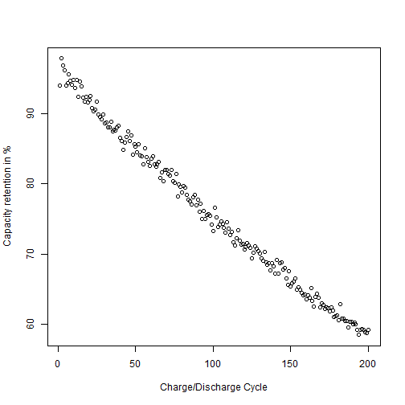

Predict the capacity fade of your Li-ion battery
========================================================
author: H. Rodriguez Alvarez
date: 11.02.2018
autosize: true

How many times did you changed your cell phone battery last year?
========================================================

How about knowing how long cell phone battery will last...

- ... it will save you money
- ...  and it will save you troubles with your partner...
- Impossible?

Possible...
========================================================

The capacity fade of all batteries looks something like this

Virtual Lab
========================================================
To determine the best prediction model we setup a virtual lab. In your virtual lab you have 

- 4 cells with different impedances measured at different temperatures
- different equipment with which you can measure the capactiy fade 

The Li-ion app will make  for you a prediction based on your data for cell you want!

Output
========================================================

For a given 

- impedance (you can read this from the internet)
- temperature (planning a vacation at the beach?)

you can now determine what is the expected capacity fade. Furthermore you can also determine what is the necessary accuracy of you measuring equipment to make the best prediction.

 So now jsut go to your convenience store and get you battery!
